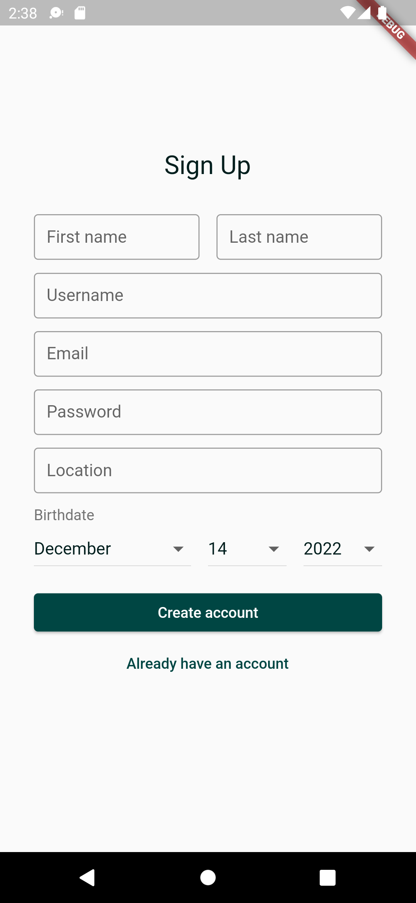

# Teodou

## Author

- Garth Hendrich C. Lapitan
- 2020-02368
- D-2L

## App Description

A to-do application that can be shared with friends!

## Screenshots

## Details

I have implemented swipeable pages connected to a bottom navigation bar with the help of this [Youtube video](https://www.youtube.com/watch?v=mgpW7Ba2Pns)

## Challenges

I wanted to add shadows to the to-do items but a ListTile widget does not have a property to allow that. So I tried wrapping the ListTile widgets with Card widgets since the Card widget has an elevation property that casts a shadow. However, when it comes to rounded corners, the shape I set for the ListTile is different from the Card's default shape. This results to the Card's shadow not exactly fitting the ListTile's shape. Instead of setting a shape property to both the Card at ListTile—which makes the code redundant—, I moved the background color and shape properties from the ListTile widget to the Card widget so that the item styles are applied to only the Card widgets.

I tried making a widget test where logging in with a wrong password must display an error message. However, the test fails even though I think I'm doing things right. By thorough debugging, I have found out that with the mock firebase authentication, entering a wrong password would still result to a successful login. This is when I have discovered that for the said authentication package, errors are raised manually.

## Test cases

### Happy paths

&nbsp; :heavy_check_mark: Can log-in with correct credentials.

&nbsp; :heavy_check_mark: Can sign-up with set requirements.

### Unhappy paths

&nbsp; :heavy_check_mark: Prevent trying to log-in without filling up the input fields.

&nbsp; :heavy_check_mark: Show error messages with logging-in.
